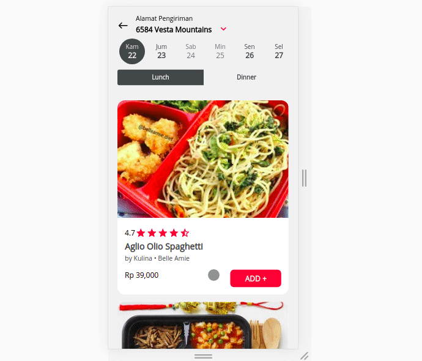

## Kulina App Mobile View Clone

This repo contains the mobile view page based on given designs using ReactJS.



## Tech Stack

TypeScript, React, Styled-component, Redux, Webpack

## Getting Started

Make sure you have git [(download here)](https://git-scm.com/downloads) and node [(download here)](https://nodejs.org/en/) installed in your system:

1. Clone this repo

2. Move into the directory `cd web`

3. Install the packages

```bash
npm install
# or if you use yarn
yarn
```

4 . Run the application

(in development)

```bash
npm run dev
# or if you use yarn
yarn dev
```

(in production)

```bash
npm run build && npm run start
# or if you use yarn
yarn build && yarn start
```
